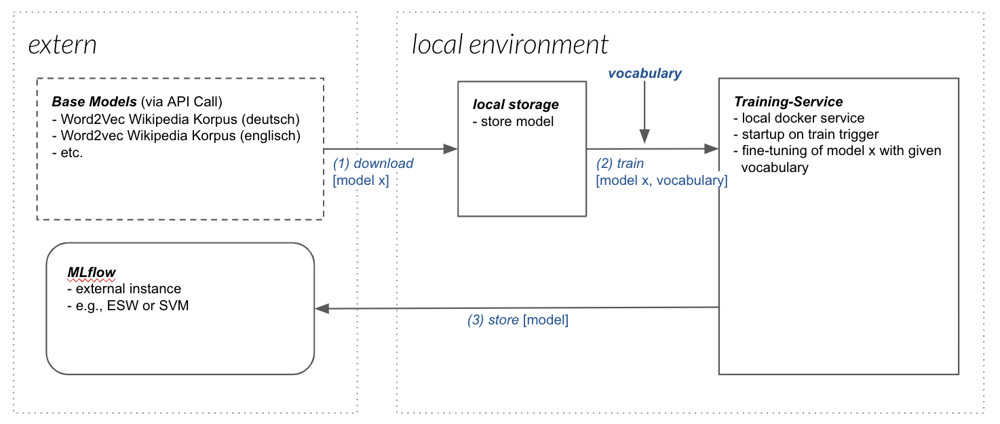
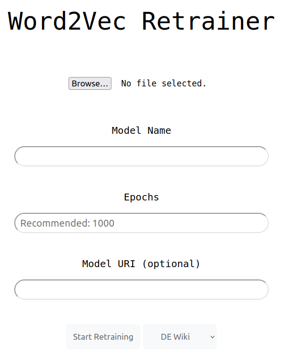
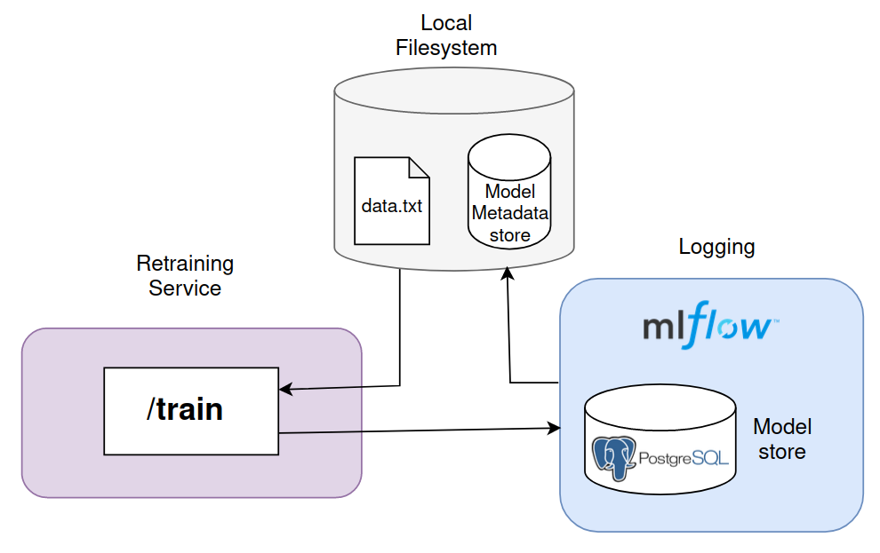
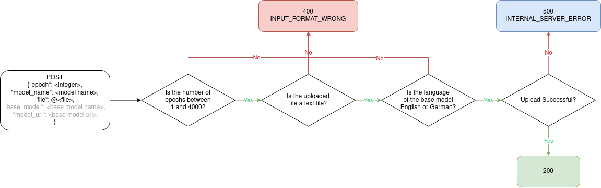
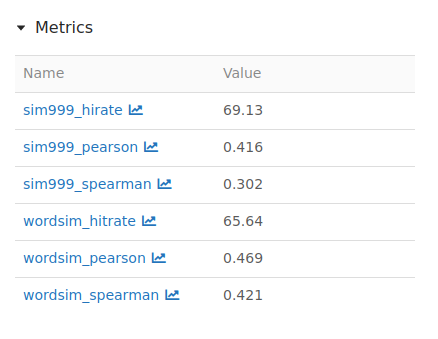

# Word2Vec Finetuning Service

> Easily retrain Natural Language Processing base models with your own training data.

## About the service

This service enables you to retrain selected Word2Vec basemodels with your own training data. You can to access the 
service via an API or a UI, in which you must submit your training data as a .txt file, based on which the Word2Vec 
model will be retrained. The retrained models will be logged on the local Mlflow environment (default) or an existing
remote MlFlow server of your choice.

This Python service was initially developed as an internal tool of the
[Service-Meister project](https://www.servicemeister.org/) (https://www.servicemeister.org/) to facilitate the fine-tuning process of NLP Models for 
a technical service context. The goal with the publication of this software is to allow data scientists to use this 
tool as a part of their own workflow.

You simply upload a text file containing preprocessed training data and select one of the provided base models 
from a dropdown menu. You can then specify a name for the model and the desired number of epochs for which it shall be 
trained. (For more information on how to use this service, see the [usage options](#21-usage-options))

This project is part of the collaboration between [KROHNE Messtechnik GmbH](https://de.krohne.com/de/) (https://de.krohne.com/de/) and [inovex GmbH](https://www.inovex.de/de/) (https://www.inovex.de/de/) within the [Service-Meister research project](https://www.servicemeister.org/) (https://www.servicemeister.org/).

Contact: https://www.inovex.de/de/kontakt/


## Table of Contents
[1. Setup and local execution](#1-setup-and-local-execution)  
[2. Service components and architecture](#2-usage-and-architecture)  
&ensp; [2.1 Usage options](#21-usage-options)  
&ensp; &ensp; &ensp; [2.1.1 User interface](#211-user-interface)  
&ensp; &ensp; &ensp; [2.1.2 API](#212-api)  
&ensp; [2.2 Architecture overview](#22-architecture-overview)  
&ensp; [2.3 Event flow & HTTP-responses](#23-event-flow--http-responses)  
[3. Base model descriptions](#3-base-model-descriptions)  
[4. Evaluation](#4-evaluation)  
[5. Project organization](#5-project-organization)  

### Quick start guide 

### Description
The base utilities of this service consist of three major parts: Downloading model, 
training model and model storage. A more detailed illustration can be found below:



## 1. Setup and local execution

### Install

If you haven't already, clone this repository
``` 
git clone https://gitlab.inovex.de/service-meister/search-group/word2Vec-finetuning-service.git 
```

For starting the local execution of the service, there is a `local-exec/docker-compose.yaml` 
which contains all the necessary services.


### Change Environment Variables (Optional)

Configs for MLFlow can be changed in the `docker-compose.yaml` directly.
For instance, if you wish to store the retrained models on an existing remote MlFlow server that you own, you must 
change the `MLFLOW_TRACKING_URI`. If the server is password-protected, you must also provide the 
`MLFLOW_TRACKING_USERNAME` and `MLFLOW_TRACKING_PASSWORD` so that the Word2vec service can connect with your custom 
MlFlow tracking server.  
`
Note: for the Model evaluaton to work with models that were selected from your own private mlflow repository, the model
must have a "language" tag set to either "en" for english or "de" for german.
`


### Setup 


1. Install [**Docker-compose**](https://docs.docker.com/compose/) (https://docs.docker.com/compose/). 
    > _The commercial usage of Docker is licensed._ (Find a suitable alternative for your OS, if using it commercially)

2. Change directory into `./retrainer/retrainer-execution`.


### Start local execution

4. Start all services and volumes:
    ```shell
    docker-compose up --build
    ```
   Note: After running the service for the first time, you can omit the `--build` flag provided that you did not make
   any changes in the code. And you might need to add `sudo` (when using unix) in front of the command to have the right permissions.

   This will start 3 separate docker containers:
   - Word2Vec service to `/train` model with your data;
   - MlFlow service to log models;
   - PostgreSQL database for the model metadata.

   Please make sure that all 3 containers are running as follows by running `docker ps`. 
   Otherwise, please restart the service.  
      ```shell
      > docker ps
      CONTAINER ID   IMAGE          COMMAND                  CREATED          STATUS                    PORTS                                       NAMES
      496e1e27eed1   word2vec:1.0   "gunicorn -t 0 -b 0.…"   59 minutes ago   Up 59 minutes             0.0.0.0:5004->5004/tcp, :::5004->5004/tcp   word2vec
      ec8e00bd1a18   mlflow         "mlflow server --bac…"   59 minutes ago   Up 59 minutes             0.0.0.0:5000->5000/tcp, :::5000->5000/tcp   mlflow
      ab56ba78aa0c   postgres:11    "docker-entrypoint.s…"   59 minutes ago   Up 59 minutes (healthy)   0.0.0.0:5432->5432/tcp, :::5432->5432/tcp   postgres_db
      ```

   You can access the services under the following links (the PostgreSQL database is omitted here because
   you will not need to interact with it).

   | Service  | Address                                    | Usage                       |
   |----------|--------------------------------------------|-----------------------------| 
   | Word2Vec | [http://0.0.0.0:5004](http://0.0.0.0:5004) | Model retraining UI and API |
   | MlFlow   | [http://0.0.0.0:5000](http://0.0.0.0:5000) | View retrained models       |

### Stopping the service
If you want to stop the service from running without deleting the models that 
you trained, you can use the following command from the `.retrainer/retrainer-execution/` directory:
  ```bash
  docker-compose down 
  ```

### Reset local execution
If instead you want to **_delete_** all your models and reset the service, you can add 
the `--volumes` tag:
  ```bash
  docker-compose down --volumes
  ```

<br> 

## 2. Usage and architecture

This section contains explanations about the different ways to use the service and how it's 
[architecture](#22-architecture-overview)  is set up.

### 2.1 Usage options

After you have completed the  [setup](#1-setup-and-local-execution), you can choose between two ways to use the 
service. Both are presented below.

#### 2.1.1 User Interface



The `/train`-endpoint can be used through a simple UI. Open the service [the service](http://0.0.0.0:5004) http://0.0.0.0:5004 in your browser
and provide a text file, a model name and a number of epochs. Then, you can select the base model you want to use.
(Beware of picking a base model of the same language that your training data is in. Currently, english and german 
are supported.)  

If you want to re-use a retrained model stored on the MlFlow instance as a base model, you can do so 
by providing the optional `Model URI` parameter. If you use the integrated default Mlflow server, the model URI will 
look something like this:  
`/mnt/persistent-disk/artifact/0/<some-id>/artifacts/model`  
You can find the model URI by navigating to the [MlFlow instance](http://0.0.0.0:5000) http://0.0.0.0:5000, clicking on a run and then 
opening the **Artifacts > model > Full Path**

After clicking `Submit request` the selected base model will be retrained with your training data for the indicated 
number of epochs and stored the local [MlFlow instance](http://0.0.0.0:5000) http://0.0.0.0:5000 that was automatically started in the 
background. If you are using your own MlFlow server, should find the new retrained model there.


#### 2.1.2 API

In addition to the UI, you can use the service programmatically via an API. Simply send a POST request to 
`http://0.0.0.0:5004/api/` like in the examples provided below
examples provided below.

##### Required parameters
`use_case_name` (str): Name of the experiment / project <br>
`dataset_identifier` (str): Name of the dataset within your project
`base_model_name` (str): Name of the base model, if base model does not exist then DE_WIKI will be used  

##### Optional parameters
`model_uri`: (str) For specifying a base model from the MLFlow server (details can be found [here](#211-user-interface))


##### Examples

#### HTTP Request
```console
http://0.0.0.0:5004/train?epoch=<epochs>&model_name=<model name>
```

#### Python: Without specific MlFLow URI
```console
import requests

data = {
            'epoch': 1, 
            'model_name': 'Bar',
            'base_model': 'DE_Wiki'
        }
r = requests.post('http://127.0.0.1:5004/api',
                  data=data,
                  files={'file': open('example.txt', 'rb')})
print(r.text)
```

#### Python: With specific MlFLow URI
```console
import requests

 model_uri = 'gs://gse-mlflow-tracking/28/<uri>/artifacts/model/'

 data = {
            'epoch': 1, 
            'model_name': 'final_test',
            'model_uri': model_uri
         }
         
 r = requests.post
     (
      'http://127.0.0.1:5004/api',
       data=data,
       files={'file': open('example.txt', 'rb')},
       timeout=1000
      )
 
 # increase timeout when retraining with a large dataset
 
 print(r.text)
```


### 2.2 Architecture overview



Our Word2Vec service provide a `/train` endpoint. The retrained models are tagged and then logged 
via [MLFlow](https://mlflow.org/), a 3rd-party tool.


### 2.3 Event flow & HTTP-responses



## 3. Base model descriptions
|Model Name|Description|Source|
|:-|:-|:-|
|DE_Wiki|A selftrained German Word2Vec model based on German Wikipedia articles.||  
|EN_Wiki|An English Word2Vec model based on English Wikipedia articles.|https://zenodo.org/record/6542975|
|DE_AT|A German Word2Vec model based on DE_Wiki, trained on the basis of Austrian public web content in 2019.|https://wortschatz.uni-leipzig.de/en/download/German|
|DE_CH|A German Word2Vec model based on DE_Wiki, trained on the basis of Swiss public web content in 2019.|https://wortschatz.uni-leipzig.de/en/download/German|
|DE_Positive|A German Word2Vec model based on DE_Wiki, trained on the basis of a list with positive words with regards to sentimental aspect of human beings.|https://wortschatz.uni-leipzig.de/de/download|
|DE_Negative|A German Word2Vec model based on DE_Wiki, trained on the basis of a list with negative words with regards to sentimental aspect of human beings.|https://wortschatz.uni-leipzig.de/de/download|
|DE_News|A German Word2Vec model based on DE_Wiki, trained on the basis of German newspaper content in 2022.|https://wortschatz.uni-leipzig.de/en/download/German#deu_news_2022|
|EN_AU|An English Word2Vec model based on EN_Wiki, trained on the basis of Australian web content in 2020.|https://wortschatz.uni-leipzig.de/en/download/English|
|EN_CA|An English Word2Vec model based on EN_Wiki, trained on the basis of Canadian web content in 2020.|https://wortschatz.uni-leipzig.de/en/download/English|
|EN_GB|An English Word2Vec model based on EN_Wiki, trained on the basis of web content in 2002 from the Great Britain.|https://wortschatz.uni-leipzig.de/en/download/English|
|EN_ZA|An English Word2Vec model based on EN_Wiki, trained on the basis of South African web content in 2020.|https://wortschatz.uni-leipzig.de/en/download/English|  

All models are stored under https://huggingface.co/JayInovex/Word2Vec-Finetuning-Service-Base-Models

<br> 


## 4. Evaluation

```
Note: the metrics provided throw the integrated evaluation are kept as generic
as possible. Make sure to use your own additional task-specific evaluation if you 
are using this service to train a model for a specfifc usecase.
```

Internally, after your model has been retrained, the service will evaluate it using the standard word pair similarity
test. For this, your model will be tested with two of the most common datasets for this task: the Hill et al. 2014 
[Sim999](https://fh295.github.io/simlex.html) (https://fh295.github.io/simlex.html) dataset containing 999 word pairs and their similarity score, as well 
as the [WordSim353](http://alfonseca.org/eng/research/wordsim353.html) (http://alfonseca.org/eng/research/wordsim353.html) dataset, developed and maintained by
E. Gabrilovich.


The results of the evaluation will be logged with your MlFlow run for the given model under the `metrics` section.
You will find 6 key-value pairs: 
   


The `sim999` or `wordsim` prefix indicates what dataset was used to generate the metrics. Then, you have 3 possible 
suffixes:

`hitrate`: This is the percentage of word pairs for which the Word2Vec model was able to calculate a similarity score. 
In this case (again for the sim999 dataset), the returned value of 69.13 indicates that the model was able to 
calculate a similarity score for 69.13% of the word pairs in the evaluation dataset. If this percentage is very low, 
this may be due to the fact that the words in the evaluation dataset are not present in the Word2Vec vocabulary, or 
that they occur too infrequently in the training data to have learned reliable embeddings.

`pearson`: This is the Pearson correlation coefficient between the similarity scores given in the word pairs 
file and the similarity scores calculated by the Word2Vec model. The Pearson correlation coefficient measures the 
linear relationship between two variables, and ranges from -1 to +1, with 0 indicating no correlation. In this case, 
(for the sim999 dataset) the returned value of 0.416 indicates a moderately strong positive correlation between the two
sets of similarity scores.

`spearman`: This is the Spearman rank correlation coefficient between the similarity scores given in the word
pairs file and the similarity scores calculated by the Word2Vec model. The Spearman rank correlation coefficient 
measures the monotonic relationship between two variables, and ranges from -1 to +1, with 0 indicating no correlation.
In this case (for the sim999 dataset), the returned value of 0.302 indicates a moderately strong positive correlation 
between the two sets of similarity scores.


## 5. Project organization

```

├── AUTHORS.md             <- List of developers and maintainers. 
├── doc                    <- Directory for README content. 
├── Dockerfile             <- Dockerfile for word2vec service.
├── LICENSE.txt            <- License as chosen on the command-line.
├── README.md              <- The top-level README for developers.
├── requirements.txt       <- Configuration of used python packages.
└── retrainer              <- Python code for all the functionality

```

